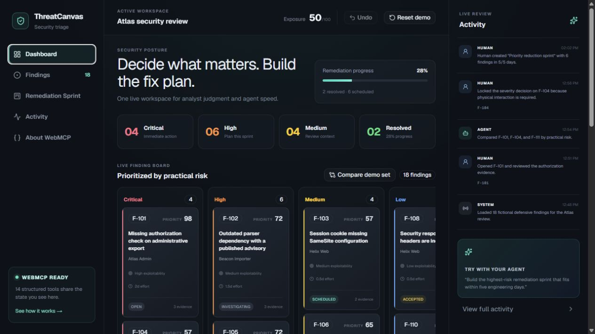

# ThreatCanvas

**A human-in-the-loop security triage workspace where analysts and AI agents investigate findings, preserve judgment, and build explainable remediation sprints through browser-native WebMCP tools.**

ThreatCanvas is a complete OpenAI WebMCP Challenge project. It ships a polished manual application and exposes the same domain operations to compatible agents with `document.modelContext.registerTool(...)`. The UI and every WebMCP tool mutate one shared, durable browser workspace—no shadow database, fake tool buttons, or DOM-click simulation.



## Why WebMCP fits

Security triage is structured but contextual. Agents are good at scanning many findings, comparing evidence, and fitting work into a limited sprint. Humans must retain control of severity, acceptance, and scheduling decisions. Without WebMCP, an agent has to infer the page, locate controls, click through menus, and guess whether a change worked. ThreatCanvas instead exposes explicit, schema-validated capabilities with visible effects and provenance.

Humans can:

- review evidence, reasoning, and remediation guidance;
- adjust severity and workflow status;
- attach context, lock decisions, remove sprint items, undo, and reset the demo;
- see which actions came from a human, an agent, or the system.

Agents can:

- list and inspect findings;
- compare and reprioritize a selected set;
- calculate a transparent risk summary;
- create capacity-aware remediation sprints from an explicit selection or a one-call risk, effort, or risk-to-effort optimization;
- add notes and propose status or severity changes;
- retrieve activity history.

Human locks are enforced in the domain layer. An agent cannot change a locked rating or move a locked finding. Accepted risk and resolved work are excluded from automatic scheduling, while manual sprint removals remain excluded during later optimization and rebalancing.

## WebMCP implementation

ThreatCanvas feature-detects the current imperative API on `document.modelContext`, with the deprecated `navigator.modelContext` location only as a compatibility fallback. Fourteen tools are registered with JSON Schema inputs, focused descriptions, and current `readOnlyHint` / `untrustedContentHint` annotations. An `AbortController` unregisters the page's tool set during React cleanup.

The tool handlers call the same immutable functions used by the React interface:

```text
Human controls ─┐
                ├─> validated WorkspaceApi ─> browser-persisted state ─> visible UI
WebMCP tools ───┘                              └─> provenance activity log
```

Read [WEBMCP.md](./WEBMCP.md) for the complete tool catalog and testing prompts, and [ARCHITECTURE.md](./ARCHITECTURE.md) for trust boundaries and state semantics.

## Run locally

Requirements: Node.js 22.13+ and pnpm.

```bash
pnpm install
pnpm dev
```

Open `http://localhost:3000`. The full manual workflow works in ordinary browsers. For agent tools, use ChatGPT's in-app browser or a compatible Chrome build with WebMCP enabled.

## Verify

```bash
pnpm typecheck
pnpm test
pnpm lint
pnpm build
```

The tests cover the scoring formula, input validation, immutability, provenance, human-lock enforcement, sprint capacity, and preserved human exclusions.

## Defensive data only

All 18 seeded findings, product names, evidence items, and review events are fictional. The demo contains no live target data, credentials, exploit payloads, or offensive automation. See [SECURITY.md](./SECURITY.md).

## Documentation

- [WEBMCP.md](./WEBMCP.md) — tools, schemas, demo prompts, browser support
- [ARCHITECTURE.md](./ARCHITECTURE.md) — state model, trust boundaries, safety properties
- [JUDGES.md](./JUDGES.md) — two-minute evaluator path
- [DEMO_SCRIPT.md](./DEMO_SCRIPT.md) — narrated video script
- [DEVPOST_SUBMISSION.md](./DEVPOST_SUBMISSION.md) — submission-ready project story
- [CONTRIBUTING.md](./CONTRIBUTING.md) — local contribution workflow

Additional verified interface captures are in [`demo/screenshots`](./demo/screenshots): the WebMCP tool surface, finding evidence view, capacity-aware sprint, and human/agent activity history.

## License

MIT — see [LICENSE](./LICENSE).

